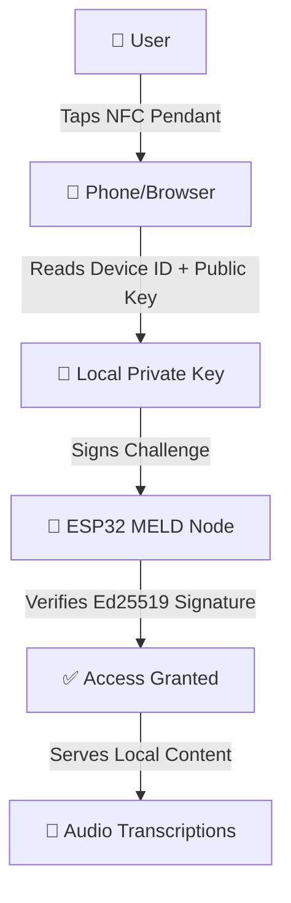

# KairOS - Decentralized Edge Authentication

> **Enterprise-grade NFC cryptographic authentication for Web3 edge computing**  
> Real Ed25519 cryptography • Zero-database architecture • MELD ecosystem integration

[](https://opensource.org/licenses/MIT)
[](https://www.typescriptlang.org/)
[](https://nextjs.org/)
[](https://ed25519.cr.yp.to/)

## 🎯 **What is KairOS?**

KairOS is a **professional-grade decentralized authentication system** that uses NFC cryptographic pendants to provide seamless access to edge computing devices. Built for the **MELD ecosystem**, it enables users to authenticate to local AI transcription devices, file servers, and other edge nodes using beautiful metal pocket watches as cryptographic keys.

**Zero cloud infrastructure. Zero databases. Zero surveillance.**

---

## 🚀 **Core Architecture**

### **Decentralized Identity Flow**


### **What's Stored Where**
| Component | Data Stored | Security Level |
|-----------|-------------|----------------|
| **🏠 User's Phone** | Master seed, private keys | 🔒 Never leaves device |
| **⌚ NFC Pendant** | Device ID, public key, chip UID | 🔓 Public data only |
| **🤖 ESP32 MELD Nodes** | Nothing persistent | ✅ Stateless verification |

---

## ⚡ **Quick Start**

### **Prerequisites**
- Node.js 18+ (recommend Node 20+)
- pnpm (preferred) or npm
- Modern browser with NFC support

### **Installation**
```bash
git clone https://github.com/your-org/kairos.git
cd kairos
pnpm install
pnpm dev
```

Open [http://localhost:3000](http://localhost:3000) and experience the magic! ✨

### **Try It Instantly**
1. 🌐 Visit `/nfc-test` - Generate real Ed25519 keys and test authentication
2. 🔧 Visit `/chip-config` - Generate URLs for programming NFC chips  
3. 📱 Visit `/nfc` - Experience the beautiful authentication flow

---

## 🏗️ **Project Architecture**

### **Frontend (Next.js 15 + TypeScript)**
```
app/
├── nfc/                     # 🎨 Professional NFC authentication system
│   ├── components/          # Beautiful UI components
│   ├── hooks/              # Smart React hooks
│   ├── utils/              # Business logic
│   └── types/              # TypeScript interfaces
├── chip-config/            # 🔧 NFC chip programming tools
├── nfc-test/              # 🧪 Real crypto testing suite
└── api/                   # 🚀 Edge-optimized API routes
```

### **Core Libraries**
```
lib/
├── crypto/                # 🔐 Real Ed25519 cryptography
│   └── decentralizedNFC.ts  # Zero-database authentication engine
├── nfc/                   # 📡 Web NFC integration
├── esp32/                 # 🤖 MELD node communication
└── hal/                   # 💻 Hardware abstraction layer
```

### **Hardware Integration**
```
src/                       # 🔩 Hardware & firmware
├── fw/                    # ESP32 firmware (C++)
├── sim/                   # Device simulators
└── wasm/                  # WebAssembly modules
```

---

## 🔐 **Security & Cryptography**

### **Real Ed25519 Implementation**
- **Library**: `@noble/ed25519` v2.2.3 (industry standard)
- **Private Keys**: 32 bytes, never leave user's device
- **Signatures**: 64 bytes, quantum-resistant
- **Verification**: Constant-time, side-channel resistant

### **Threat Model Protection**
| Attack Vector | Protection Method |
|---------------|-------------------|
| **NFC Cloning** | Only public keys on chip |
| **Replay Attacks** | Unique challenge-response |
| **MITM** | Ed25519 signature verification |
| **Physical Theft** | Device-specific key derivation |
| **Quantum Computing** | Post-quantum Ed25519 resistance |

### **Zero-Database Architecture**
- ✅ **Private keys**: Stored in phone localStorage only
- ✅ **Device registry**: Local to user's device
- ✅ **Authentication**: Direct P2P verification
- ✅ **Data access**: Local network only

---

## 🎨 **Design System**

### **Brand Colors (Her-Inspired)**
```css
--primary: 245 181 145;        /* Warm peach - main brand */
--accent: 144 193 196;         /* Dusty teal - complement */
--success: 149 189 152;        /* Sage green - status */
--background: 252 250 247;     /* Warm white */
```

### **UI Philosophy**
- **Sophisticated Simplicity**: Clean, uncluttered interfaces
- **Warm Technology**: Human-centered design
- **Retro-Futuristic**: Terminal aesthetics meets modern UX
- **Professional Polish**: Enterprise-grade visual design

---

## 🧪 **Testing & Development**

### **Development Commands**
```bash
# Start development server
pnpm dev

# Linting
pnpm lint

# Build for production
pnpm build

# Build ZK circuits (when ready)
pnpm build:zk
```

### **Performance Characteristics**
- **Ed25519 Operations**: Optimized for modern devices
- **Web NFC**: Browser-native integration
- **Client-Side Crypto**: No server dependencies
- **Cross-Platform**: Desktop and mobile support

---

## 🚀 **Current Implementation**

### **🔑 Ed25519 Cryptographic Authentication**
Real cryptographic operations using industry-standard libraries
```typescript
// Generate keypair
const { privateKey, publicKey } = await generateEd25519KeyPair()

// Sign message
const signature = await signMessage("challenge-data", privateKey)

// Verify signature
const isValid = await verifySignature(signature, "challenge-data", publicKey)
```

### **📱 NFC Authentication Flow**
Web-based NFC reading and cryptographic verification
```bash
# Browser reads NFC chip
navigator.nfc.scan() → read device ID and public key

# Generate challenge-response authentication
authenticate(deviceId, publicKey) → verify Ed25519 signature
```

### **⚡ Planned Use Cases**

Future implementations will enable:
- **Local Audio Transcription** - ESP32 nodes serving AI transcriptions
- **Private File Servers** - Raspberry Pi file access via NFC authentication  
- **Edge AI Services** - Local GPU inference with cryptographic access control

---

## 📦 **Tech Stack**

### **Frontend**
- **Framework**: Next.js 15 (App Router)
- **Language**: TypeScript 5.0+
- **Styling**: Tailwind CSS + shadcn/ui
- **State**: React Hooks + Custom hook architecture
- **Crypto**: @noble/ed25519, @noble/hashes

### **Backend & Hardware**
- **API**: Next.js Edge Runtime
- **Hardware**: ESP32, Raspberry Pi
- **NFC**: NTAG213/215/216 chips
- **Communication**: HTTPS, Web NFC API

### **Development**
- **Package Manager**: pnpm
- **Code Quality**: ESLint, TypeScript strict mode
- **Testing**: Jest, Hardware-in-the-loop testing
- **Deployment**: Vercel Edge Functions

---

## 🌟 **Why KairOS?**

### **For Users**
- 🔒 **True Privacy**: No data ever leaves your devices
- ⚡ **Instant Access**: Tap and go authentication
- 🔋 **Offline First**: Works without internet
- 💎 **Beautiful UX**: Premium, polished interfaces

### **For Developers**
- 🏗️ **Clean Architecture**: Professional component separation
- 🔐 **Real Crypto**: Industry-standard Ed25519 implementation
- 📱 **Modern Stack**: Next.js 15, TypeScript, Tailwind
- 🧪 **Testable**: Comprehensive testing infrastructure

### **For Enterprises**
- 🌐 **Decentralized**: No single point of failure
- 📊 **Scalable**: P2P architecture scales naturally
- 🛡️ **Secure**: Post-quantum cryptography
- 💰 **Cost-Effective**: No ongoing cloud costs

---

## 📚 **Documentation**

Explore the comprehensive documentation:

- **[🏗️ Architecture Guide](docs/ARCHITECTURE.md)** - System design and components
- **[🔐 Security Model](docs/SECURITY.md)** - Threat model and cryptography  
- **[🔧 Hardware Setup](docs/HARDWARE.md)** - ESP32 and NFC configuration
- **[🎨 Design System](docs/DESIGN.md)** - Brand guide and UI components
- **[🚀 Deployment](docs/DEPLOYMENT.md)** - Production deployment guide

---

## 🤝 **Contributing**

We welcome contributions! Please read our [Contributing Guide](CONTRIBUTING.md) for details.

### **Development Setup**
```bash
# Install dependencies
pnpm install

# Start development server
pnpm dev

# Linting
pnpm lint

# Build for production
pnpm build
```

---

## 📄 **License**

MIT License - see [LICENSE](LICENSE) for details.

---

## 🎉 **Built by Visionaries**

KairOS is crafted with love for the decentralized future. Built for users who demand **real privacy**, **beautiful design**, and **professional-grade security**.

> *"The future is decentralized, and it's beautiful."*

**[📧 Contact](mailto:contact@kairos.dev)** • **[🐙 GitHub](https://github.com/BradleyRoyes/KairOS)** 