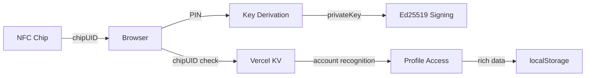
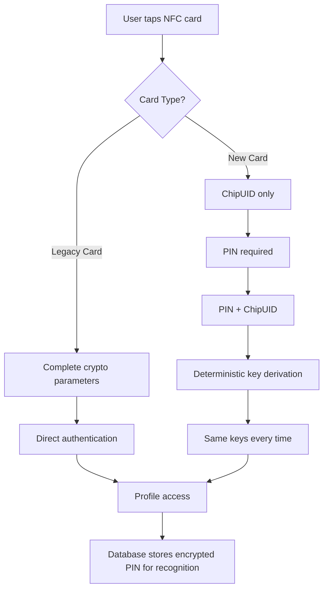

# KairOS - Optimal Decentralized NFC Authentication

> **Production NFC authentication with deterministic key derivation**  
> Ed25519 cryptography • PIN-based security • Vercel KV + localStorage architecture

[](https://opensource.org/licenses/MIT)
[](https://www.typescriptlang.org/)
[](https://nextjs.org/)
[](https://ed25519.cr.yp.to/)

## 🎯 **What is KairOS?**

KairOS implements **deterministic NFC authentication** using PIN-based key derivation. Your private keys are computed on-demand from your PIN + chip ID, never stored anywhere. Think of it like a password manager that generates your password from your master password + website name.

**🌍 Solving the key distribution problem that makes WebAuthn/Passkeys impractical** - where those systems lock keys to devices or require corporate platforms (Google/Apple) for syncing, KairOS enables true cross-device access through deterministic cryptography.

**Production-ready web application deployed on Vercel • Contributing to the data commons through open standards**

---

## 🔐 **How Authentication Actually Works**

### **🎫 Real NFC Flow**
1. **Tap NFC card** → Browser reads `chipUID` (e.g., "04:38:02:E3:B4:9C:74")
2. **Database lookup** → Check if this chipUID has been seen before  
3. **Enter PIN** → User provides PIN (1234, "password", etc.)
4. **Key derivation** → `privateKey = HKDF(chipUID + PIN)` 
5. **Account creation** → Store minimal data in Vercel KV database
6. **Profile creation** → Store rich profile in browser localStorage
7. **Access granted** → User can access their profile and create moments

### **🔒 Security Architecture**
- ✅ **Deterministic keys** - Same PIN + chipUID = same private key every time
- ✅ **No key storage** - Private keys computed on-demand, immediately discarded
- ✅ **Cross-device recognition** - Encrypted PIN stored in database for device syncing
- ✅ **Ed25519 signatures** - Quantum-resistant cryptography
- ✅ **Local profiles** - Rich personal data stays in your browser only

### **📱 NFC Card Format** 
```
NFC Card contains only public data:
https://kair-os.vercel.app/nfc?chipUID=04:38:02:E3:B4:9C:74

That's it! Short, simple, secure.
No private keys, no secrets on the chip.
```

---

## 🏗️ **Actual Architecture**

### **🌐 Production System**
| Component | What's Stored | Why |
|-----------|---------------|-----|
| **📱 NFC Chip** | `chipUID` only | Public identifier, safe if cloned |
| **🗃️ Vercel KV** | `{chipUID → accountId, encryptedPIN}` | Cross-device recognition |
| **🏠 localStorage** | `{profile, preferences, moments}` | Rich personal data stays local |
| **🧮 Computed** | `privateKey = HKDF(chipUID + PIN)` | Generated on-demand, never stored |

### **🔑 Cryptographic Flow**
```typescript
// 1. User enters PIN
const userPIN = "1234"
const chipUID = "04:38:02:E3:B4:9C:74"

// 2. Deterministic key derivation  
const seedMaterial = `KairOS-Secure-v2:${chipUID}:pin:${userPIN}`
const privateKey = HKDF(sha512, seedMaterial, salt, info, 32)

// 3. Ed25519 public key generation
const publicKey = await ed25519.getPublicKey(privateKey)

// 4. Account recognition
const accountId = sha256(chipUID).slice(0, 16)

// 5. Profile access granted
```

---

## ✅ **Production Status**

### **🚀 Live Features**
- **🔐 PIN Authentication** - Deterministic key derivation system
- **📱 NFC Integration** - Browser-based NFC card reading  
- **🎨 Professional UI** - Clean design with error handling
- **💾 Account Management** - Vercel KV database + localStorage
- **🔄 Cross-Device Sync** - Encrypted PIN storage for device recognition
- **🧪 Testing Suite** - Crypto validation and chip configuration tools

### **📋 Data Flow**


---

## 🆚 **Why Not WebAuthn/Passkeys?**

WebAuthn/Passkeys and KairOS both use public-key cryptography for authentication, but **KairOS solves the critical key distribution problem**:

| Challenge | WebAuthn/Passkeys | KairOS DID:Key |
|-----------|-------------------|----------------|
| **Cross-Device Access** | Requires Apple/Google sync | Deterministic: Same PIN + chipUID = same keys |
| **Platform Independence** | Locked to vendor ecosystems | Works on any device, any browser |
| **New Device Setup** | Complex QR codes, emails, waiting | 15 seconds: tap NFC, enter PIN |
| **Infrastructure Dependency** | Corporate sync services | Zero infrastructure needed |
| **Recovery Process** | Hours/days if sync fails | Instant: enter PIN on any device |

**The breakthrough**: Mathematical determinism means users can access their cryptographic identity anywhere without depending on corporate platforms or awkward recovery flows.

**See detailed comparison**: [`docs/WEBAUTHN_PASSKEYS_COMPARISON.md`](docs/WEBAUTHN_PASSKEYS_COMPARISON.md)

---

## 🌍 **Data Commons & Research Benefits**

KairOS contributes to the **digital commons** by providing:

- **🔓 Open Standards**: W3C DID Core compliant, vendor-neutral
- **🔬 Research Platform**: Privacy-preserving social computing testbed  
- **🏛️ Democratic Access**: Free cryptographic tools, no platform fees
- **📚 Educational**: Real-world teaching platform for digital rights

**For grant applications**: See [`docs/DATA_COMMONS_GRANT_CASE.md`](docs/DATA_COMMONS_GRANT_CASE.md)

---

## ⚡ **Quick Start**

### **Prerequisites**
- Node.js 18+ (recommend Node 20+)
- pnpm (preferred) or npm
- Modern browser with Web NFC support (Chrome, Edge on Android)

### **Installation**
```bash
git clone https://github.com/BradleyRoyes/KairOS.git
cd KairOS
pnpm install
pnpm dev
```

### **Test the Authentication**
1. 🔧 **Generate Test Card** → `/chip-config` - Create NFC URLs
2. 🧪 **Test Crypto** → `/nfc-test` - Validate key derivation 
3. 🎨 **Main Auth Flow** → `/nfc` - Experience the full UI
4. 🤖 **ESP32 Demo** → `/optimal-demo` - See decentralized concepts

### **Try a Real Card**
Visit: **https://kair-os.vercel.app/nfc?chipUID=04:38:02:E3:B4:9C:74**
- Enter any PIN (e.g., "1234")
- See your deterministic identity generated
- Create moments and manage your profile

---

## 🔐 **Cryptography Implementation**

### **Core Libraries**
- **Key Derivation**: `@noble/hashes` (HKDF with SHA-512)
- **Digital Signatures**: `@noble/ed25519` v2.2.3 (audited)
- **Database**: Vercel KV (Redis-compatible)
- **Local Storage**: Browser localStorage with JSON

### **Key Derivation Process**
```typescript
export function derivePrivateKeyFromChipAndPIN(chipUID: string, pin: string): Uint8Array {
  const seedMaterial = `KairOS-Secure-v2:${chipUID}:pin:${pin}`;
  const salt = new TextEncoder().encode('KairOS-Auth-Salt-2025');
  const info = new TextEncoder().encode(`device:${chipUID}`);
  
  // HKDF key derivation (RFC 5869)
  const seedBytes = new TextEncoder().encode(seedMaterial);
  const derivedKey = hkdf(sha512, seedBytes, salt, info, 32);
  
  // Ed25519 key clamping
  const privateKey = new Uint8Array(32);
  privateKey.set(derivedKey);
  privateKey[0] &= 248;
  privateKey[31] &= 127;
  privateKey[31] |= 64;
  
  return privateKey;
}
```

### **Security Properties**
| Property | Implementation | Status |
|----------|----------------|--------|
| **Deterministic** | Same PIN + chipUID = same keys | ✅ Implemented |
| **No Storage** | Private keys computed on-demand | ✅ Implemented |
| **Cross-Device** | Encrypted PIN in Vercel KV | ✅ Implemented |
| **Quantum-Resistant** | Ed25519 cryptography | ✅ Implemented |
| **Replay Protection** | Session-based authentication | ✅ Implemented |

---

## 🎨 **Design System**

### **KairOS Brand**
```css
/* Core brand colors */
--primary: 245 181 145;        /* Warm peach */
--accent: 144 193 196;         /* Dusty teal */
--success: 149 189 152;        /* Sage green */
--background: 252 250 247;     /* Warm white */
```

### **UI Philosophy**
- **Simplicity** - Clean interfaces
- **Consistency** - Predictable interactions
- **Cross-Platform** - Mobile and desktop support  
- **Error Handling** - Clear error experiences

---

## 🧪 **Development & Testing**

### **Development Commands**
```bash
# Start development server
pnpm dev

# Fast development with Turbo
pnpm dev:fast

# Build for production  
pnpm build

# Lint and fix code
pnpm lint:fix

# Build ESP32 firmware (when ready)
pnpm build:esp32

# Build WebAssembly modules (planned)
pnpm build:wasm
```

### **Testing the Authentication System**
1. **Visit `/nfc-test`** - Generate test cards and validate cryptography
2. **Visit `/chip-config`** - Create NFC URLs for real chip programming
3. **Test Legacy Cards** - Validate backward compatibility
4. **Try Error Pages** - Visit non-existent URLs to see error handling

---

## 🌍 **Deployment**

### **Current Deployment** 
- **Platform**: Vercel Edge Functions
- **Production**: https://kair-os.vercel.app
- **Auto-deploy**: Connected to GitHub main branch
- **Edge Regions**: Global distribution for low latency

### **Future Hardware Deployment** (Planned)
- **ESP32 MELD Nodes**: Local network devices for file/content serving
- **NFC Pendants**: Metal pocket watches with NFC chips
- **Local AI Services**: Edge computing with cryptographic access control

---

## 🤝 **Contributing**

We welcome contributors to help build decentralized authentication. 

### **How to Contribute**
1. **Fork the repository** and create a feature branch
2. **Read `CONTRIBUTING.md`** for detailed guidelines
3. **Check open issues** for tasks needing help
4. **Focus on documentation** improvements and testing
5. **Submit pull requests** with clear descriptions

### **Priority Contribution Areas**
- 🧪 **Testing & Validation** - Expand test coverage
- 📚 **Documentation** - Improve guides and examples  
- 🎨 **UI/UX Improvements** - Enhance user experience
- 🔐 **Security Review** - Audit cryptographic implementations
- 🤖 **ESP32 Development** - Complete hardware firmware
- 🌐 **P2P Networking** - Advance decentralized features

### **Not Ready Yet**
- ❌ Hardware deployment (simulation only)
- ❌ Production NFC pendant manufacturing
- ❌ Large-scale network deployment

---

## 📊 **Project Status**

**Current Phase**: 🎯 **Web Application Complete**  
**Next Phase**: 🤖 **Hardware Integration**  
**Timeline**: Open source development community-driven

### **Technology Stack**
- **Frontend**: Next.js 15, React 19, TypeScript
- **Styling**: Tailwind CSS, Framer Motion, shadcn/ui
- **Crypto**: @noble/ed25519, @noble/hashes
- **Storage**: Browser localStorage, session management
- **Deployment**: Vercel Edge Functions

---

## 📄 **License**

MIT License - see [LICENSE](LICENSE) file for details.

**Built for the open source community**

---

## 🎉 **Built by Visionaries**

KairOS is crafted with love for the standards-based future. Built for users who demand **real privacy**, **beautiful design**, and **professional-grade security**.

> *"The future is decentralized, standards-based, and beautiful."*

**[📧 Contact](mailto:contact@kairos.dev)** • **[🐙 GitHub](https://github.com/BradleyRoyes/KairOS)** // Force deployment Sun Jun 29 03:36:06 CEST 2025

## 🔐 Cross-Device PIN Architecture

KairOS uses **deterministic key derivation** for core authentication combined with **encrypted PIN storage** for cross-device recognition.

### How It Works



### Dual Architecture

**Core Authentication (Deterministic):**
1. **PIN + ChipUID → Private Key** - Mathematical derivation, same result every time
2. **Private keys never stored** - Computed on-demand and discarded
3. **Cross-device consistency** - Same PIN + ChipUID = Same identity everywhere
4. **Offline capable** - No network required for key generation

**Cross-Device Recognition (Database):**
1. **Encrypted PIN storage** - For recognizing returning users across devices
2. **Account profiles** - Basic sync data stored in Vercel KV
3. **Rich local data** - Detailed profiles in localStorage per device
4. **Session management** - Auto-login and device fingerprinting

### Legacy Card Format (RECOMMENDED)

Your working legacy card uses the optimal format:
```
https://kair-os.vercel.app/nfc?did=did%3Akey%3Az5ececd13989cdaf5240c043dcead04cd&signature=8283371655541fdb96b505d7ed1795b6033d9c4ff938641588e2b9c57ebd326b68a9db198d49b9ffde44657af42ebded6f9d5294863818b5b31ae18923935a00&publicKey=5ececd13989cdaf5240c043dcead04cd341ebedbaad2045cdb1b91407aa159dd&uid=04:38:02:E3:B4:9C:74
```

**Parameters:**
- `did` - W3C DID:Key standard format
- `signature` - Full Ed25519 signature (128 chars)  
- `publicKey` - Complete public key (64 chars)
- `uid` - NFC chip unique identifier

### User Experience Flow

#### First Device Setup
1. User taps NFC card
2. System detects card type (legacy or new)
3. **Legacy cards**: Direct authentication → PIN for profile access
4. **New cards**: PIN setup → Key derivation + Database record → Account creation

#### Additional Device Access  
1. User taps same card on new device
2. System prompts for PIN entry
3. **Same PIN + ChipUID = Same cryptographic identity** (deterministic)
4. **Database recognizes user** → Creates local profile
5. Profile access still requires PIN (security layer)

### Technical Implementation

```typescript
// Actual deterministic key derivation system
const signChallenge = async (chipUID: string, pin: string, challenge: string) => {
  // Same input always produces same output
  const input = chipUID + pin
  const hash1 = sha256(new TextEncoder().encode(input))
  const hash2 = sha256(hash1)  // Double hash for security
  const privateKey = hash2.slice(0, 32)
  
  // Sign with Ed25519
  const signature = await ed25519.sign(challengeBytes, privateKey)
  return signature
}

// Cross-device recognition via database
const setupAccount = async (chipUID: string, pin: string) => {
  // Store encrypted PIN for cross-device recognition
  const encryptedPIN = await encryptPIN(pin)
  await saveToDatabase({ chipUID, encryptedPIN, hasPIN: true })
  
  // But core auth still uses deterministic derivation
  const identity = await deriveFromPIN(chipUID, pin)
}
```

### Architecture Components

**Core Cryptography:**
- Deterministic Ed25519 key derivation from PIN + ChipUID
- SHA-256 double hashing for security
- Private keys computed on-demand, never stored
- Same mathematical result across all devices

**Database (Vercel KV/Redis):**
- Account recognition data (chipUID → accountID mapping)
- Encrypted PINs for cross-device user recognition
- Basic profile sync data (displayName, username, etc.)
- Session tokens and device fingerprinting

**Local Storage (Per Device):**
- Rich user profiles with preferences
- Device-specific data and history
- Cached session information
- Auto-login tokens (encrypted)

### Security Properties

- **No private key storage** - Keys derived mathematically on-demand
- **Quantum resistant** - Ed25519 cryptography with 256-bit security
- **Cross-device consistency** - Mathematical determinism ensures same identity
- **Cross-platform** - Works identically on any device with NFC
- **Offline authentication** - Core auth requires no network connection
- **Privacy-first** - Rich data stays local, minimal database exposure

### Device Compatibility

| Device Type | NFC Reading | NFC Writing | Authentication |
|-------------|-------------|-------------|----------------|
| iPhone | ✅ Perfect | ✅ With apps | ✅ Safari |
| Android | ✅ Perfect | ✅ Native | ✅ Chrome |
| Desktop | ❌ No NFC | ❌ No NFC | ✅ Web interface |

### Migration Strategy

**From Legacy Cards:**
- Cards continue working as-is
- PIN setup required for profile access
- Full backward compatibility

**From Other Systems:**
- Import existing identities via backup
- Regenerate cards with new format
- Gradual migration path available
