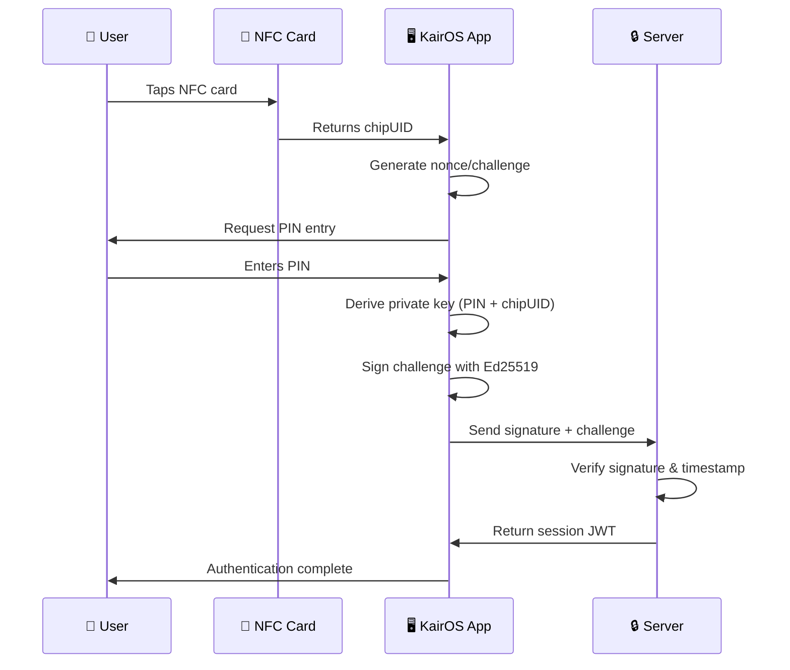

# KairOS - Decentralized NFC Authentication

> **Enterprise-grade NFC challenge-response authentication for Web3**  
> Ed25519 cryptography • Nonce-based security • Zero-database architecture

[](https://opensource.org/licenses/MIT)
[](https://www.typescriptlang.org/)
[](https://nextjs.org/)
[](https://ed25519.cr.yp.to/)

## 🎯 **What is KairOS?**

KairOS implements **challenge-response NFC authentication** using industry-standard cryptography. Similar to [Gnosis Pay's authentication flow](https://docs.gnosispay.com/auth), it uses nonce-based verification to prevent replay attacks and ensure secure access.

**Production-ready web application with ESP32 simulation.**

---

## 🔐 **How Authentication Works**

### **🎫 Simple NFC Flow**
1. **Tap NFC card** → Browser reads `chipUID` from card
2. **Generate challenge** → App creates unique nonce + timestamp  
3. **Enter PIN** → User provides PIN to derive signing key
4. **Sign challenge** → App signs challenge with Ed25519 private key
5. **Verify signature** → Server validates signature and issues session token
6. **Access granted** → User can interact with protected resources

### **🔒 Security Features**
- ✅ **Nonce-based challenges** - Fresh random nonce for each authentication
- ✅ **Timestamp validation** - Prevents replay attacks (60 second expiry)
- ✅ **PIN-derived keys** - Private keys computed on-demand, never stored
- ✅ **Ed25519 signatures** - Quantum-resistant cryptography
- ✅ **Session management** - JWT-style tokens with device fingerprinting

### **📱 NFC Card Format** 
```
NFC Card contains only:
https://kair-os.vercel.app/nfc?chipUID=04:38:02:E3:B4:9C:74

That's it! Short, simple, secure.
```

---

## 🚀 **Current Implementation Status**

### **✅ Production Ready**
- **🔐 Challenge-Response Auth** - Gnosis Pay-style nonce authentication
- **📱 Web NFC Integration** - Browser-based NFC card reading  
- **🎨 Professional UI** - Holographic design system with error handling
- **⚡ Multi-format Support** - Legacy card compatibility + modern crypto
- **💾 Account Management** - Encrypted local storage with PIN protection
- **🔄 Session Management** - Secure JWT-style session tokens
- **🧪 Testing Suite** - Comprehensive crypto validation tools

### **🚧 In Development**
- **🤖 ESP32 Firmware** - Real hardware implementation (simulation complete)
- **🌐 P2P Network** - Decentralized key registry (partial implementation)

### **📋 Planned Features**
- **🔗 Physical MELD Nodes** - Distributed ESP32 hardware network
- **⌚ NFC Pendant Production** - Metal cryptographic pendants
- **🎵 Audio Transcription** - Local AI transcription services
- **📁 Private File Servers** - Cryptographically secured file access

---

## ⚡ **Quick Start**

### **Prerequisites**
- Node.js 18+ (recommend Node 20+)
- pnpm (preferred) or npm
- Modern browser with Web NFC support (Chrome, Edge on Android)

### **Installation**
```bash
git clone https://github.com/BradleyRoyes/KairOS.git
cd KairOS
pnpm install
pnpm dev
```

### **Test the Authentication**
1. 🔧 **Generate Test Card** → `/chip-config` - Create NFC URLs
2. 🧪 **Test Authentication** → `/nfc-test` - Validate crypto 
3. 🎨 **Main Auth Flow** → `/nfc` - Experience the full UI
4. 🤖 **ESP32 Simulation** → `/ritual-designer` - See hardware demo

### **Production Testing**
Visit: **https://kair-os.vercel.app/nfc?chipUID=04:38:02:E3:B4:9C:74**

---

## 🏗️ **Architecture Overview**

### **Authentication Flow**


### **Security Model**
| Component | Data Stored | Security Level |
|-----------|-------------|----------------|
| **📱 User's Browser** | Encrypted profiles, session JWTs | 🔒 Local only |
| **📋 NFC Card** | chipUID only (public data) | 🔓 Public data |
| **🔒 Server** | No private keys, stateless verification | ✅ Zero-trust |

---

## 🔐 **Cryptography Details**

### **Implementation**
- **Library**: `@noble/ed25519` v2.2.3 (audited)
- **Key Derivation**: `SHA-256(chipUID + PIN)` 
- **Signatures**: Ed25519 (64 bytes, quantum-resistant)
- **Challenges**: `KairOS-DIDKey-{chipUID}-{timestamp}-{nonce}`
- **Sessions**: JWT-style tokens with 1-hour expiry

### **Threat Protection**
| Attack | Protection Method | Status |
|--------|-------------------|--------|
| **Replay Attacks** | Unique nonces + timestamps | ✅ Implemented |
| **NFC Cloning** | Only public chipUID on card | ✅ Implemented |
| **MITM** | Ed25519 signature verification | ✅ Implemented |
| **PIN Brute Force** | PIN-derived keys (offline only) | ✅ Implemented |
| **Session Hijacking** | Device fingerprinting | ✅ Implemented |

---

## 🎨 **Design System**

### **KairOS Brand**
```css
/* Core brand colors */
--primary: 245 181 145;        /* Warm peach */
--accent: 144 193 196;         /* Dusty teal */
--success: 149 189 152;        /* Sage green */
--background: 252 250 247;     /* Warm white */
```

### **UI Philosophy**
- **Simplicity** - Clean interfaces
- **Consistency** - Predictable interactions
- **Cross-Platform** - Mobile and desktop support  
- **Error Handling** - Clear error experiences

---

## 🧪 **Development & Testing**

### **Development Commands**
```bash
# Start development server
pnpm dev

# Fast development with Turbo
pnpm dev:fast

# Build for production  
pnpm build

# Lint and fix code
pnpm lint:fix

# Build ESP32 firmware (when ready)
pnpm build:esp32

# Build WebAssembly modules (planned)
pnpm build:wasm
```

### **Testing the Authentication System**
1. **Visit `/nfc-test`** - Generate test cards and validate cryptography
2. **Visit `/chip-config`** - Create NFC URLs for real chip programming
3. **Test Legacy Cards** - Validate backward compatibility
4. **Try Error Pages** - Visit non-existent URLs to see error handling

---

## 🌍 **Deployment**

### **Current Deployment** 
- **Platform**: Vercel Edge Functions
- **Production**: https://kair-os.vercel.app
- **Auto-deploy**: Connected to GitHub main branch
- **Edge Regions**: Global distribution for low latency

### **Future Hardware Deployment** (Planned)
- **ESP32 MELD Nodes**: Local network devices for file/content serving
- **NFC Pendants**: Metal pocket watches with NFC chips
- **Local AI Services**: Edge computing with cryptographic access control

---

## 🤝 **Contributing**

We welcome contributors to help build decentralized authentication. 

### **How to Contribute**
1. **Fork the repository** and create a feature branch
2. **Read `CONTRIBUTING.md`** for detailed guidelines
3. **Check open issues** for tasks needing help
4. **Focus on documentation** improvements and testing
5. **Submit pull requests** with clear descriptions

### **Priority Contribution Areas**
- 🧪 **Testing & Validation** - Expand test coverage
- 📚 **Documentation** - Improve guides and examples  
- 🎨 **UI/UX Improvements** - Enhance user experience
- 🔐 **Security Review** - Audit cryptographic implementations
- 🤖 **ESP32 Development** - Complete hardware firmware
- 🌐 **P2P Networking** - Advance decentralized features

### **Not Ready Yet**
- ❌ Hardware deployment (simulation only)
- ❌ Production NFC pendant manufacturing
- ❌ Large-scale network deployment

---

## 📊 **Project Status**

**Current Phase**: 🎯 **Web Application Complete**  
**Next Phase**: 🤖 **Hardware Integration**  
**Timeline**: Open source development community-driven

### **Technology Stack**
- **Frontend**: Next.js 15, React 19, TypeScript
- **Styling**: Tailwind CSS, Framer Motion, shadcn/ui
- **Crypto**: @noble/ed25519, @noble/hashes
- **Storage**: Browser localStorage, session management
- **Deployment**: Vercel Edge Functions

---

## 📄 **License**

MIT License - see [LICENSE](LICENSE) file for details.

**Built for the open source community**

---

## 🎉 **Built by Visionaries**

KairOS is crafted with love for the standards-based future. Built for users who demand **real privacy**, **beautiful design**, and **professional-grade security**.

> *"The future is decentralized, standards-based, and beautiful."*

**[📧 Contact](mailto:contact@kairos.dev)** • **[🐙 GitHub](https://github.com/BradleyRoyes/KairOS)** // Force deployment Sun Jun 29 03:36:06 CEST 2025
