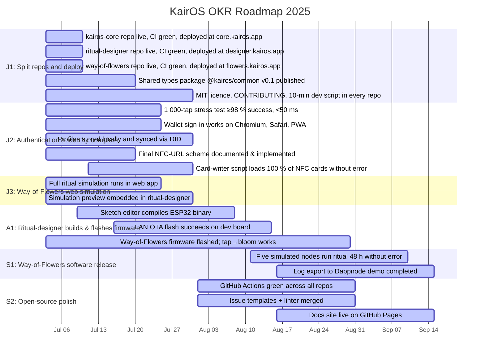

# KairOS OKR Roadmap 2025

**North Star:** Build KairOS: democratic cryptography, privacy-preserving social computing, NFC identity.

**Horizon:** 2025-09-15

## Roadmap Visualization

## Objectives Overview

| ID | Title | Owner | Due Date | Status |
|----|----|----|----|----|
| J1 | Split repos and deploy | Sam | 2025-07-31 | 🟡 In Progress |
| J2 | Authentication & identity complete | Lea | 2025-07-31 | 🟡 In Progress |
| J3 | Way-of-Flowers web simulation | Mei | 2025-07-31 | 🟡 In Progress |
| A1 | Ritual-designer builds & flashes firmware | Noor | 2025-08-31 | 🟡 In Progress |
| S1 | Way-of-Flowers software release | Mei | 2025-09-15 | 🟡 In Progress |
| S2 | Open-source polish | Dan | 2025-09-15 | 🟡 In Progress |

## Key Results

### J1: Split repos and deploy

- 🟡 **J1a:** kairos-core repo live, CI green, deployed at core.kairos.app *(Due: 2025-07-10)*
- 🟡 **J1b:** ritual-designer repo live, CI green, deployed at designer.kairos.app *(Due: 2025-07-10)*
- 🟡 **J1c:** way-of-flowers repo live, CI green, deployed at flowers.kairos.app *(Due: 2025-07-10)*
- 🟡 **J1d:** Shared types package @kairos/common v0.1 published *(Due: 2025-07-20)*
- 🟡 **J1e:** MIT licence, CONTRIBUTING, 10-min dev script in every repo *(Due: 2025-07-31)*

### J2: Authentication & identity complete

- 🟡 **J2a:** 1 000-tap stress test ≥98 % success, <50 ms *(Due: 2025-07-25)*
- 🟡 **J2b:** Wallet sign-in works on Chromium, Safari, PWA *(Due: 2025-07-25)*
- 🟡 **J2c:** Profiles stored locally and synced via DID *(Due: 2025-07-31)*
- 🟡 **J2d:** Final NFC-URL scheme documented & implemented *(Due: 2025-07-20)*
- 🟡 **J2e:** Card-writer script loads 100 % of NFC cards without error *(Due: 2025-07-31)*

### J3: Way-of-Flowers web simulation

- 🟡 **J3a:** Full ritual simulation runs in web app *(Due: 2025-07-25)*
- 🟡 **J3b:** Simulation preview embedded in ritual-designer *(Due: 2025-07-31)*

### A1: Ritual-designer builds & flashes firmware

- 🟡 **A1a:** Sketch editor compiles ESP32 binary *(Due: 2025-08-08)*
- 🟡 **A1b:** LAN OTA flash succeeds on dev board *(Due: 2025-08-15)*
- 🟡 **A1c:** Way-of-Flowers firmware flashed; tap→bloom works *(Due: 2025-08-30)*

### S1: Way-of-Flowers software release

- 🟡 **S1a:** Five simulated nodes run ritual 48 h without error *(Due: 2025-09-10)*
- 🟡 **S1b:** Log export to Dappnode demo completed *(Due: 2025-09-15)*

### S2: Open-source polish

- 🟡 **S2a:** GitHub Actions green across all repos *(Due: 2025-08-31)*
- 🟡 **S2b:** Issue templates + linter merged *(Due: 2025-08-31)*
- 🟡 **S2c:** Docs site live on GitHub Pages *(Due: 2025-09-15)*

---

*Last updated: 2025-07-03*
*Edit [okrs.yml](./okrs.yml) to update this roadmap*

📊 **[View Interactive Roadmap](https://bradleycr.github.io/kairos-okr-roadmap/okr-roadmap.html)** - Live interactive version with editing capabilities
