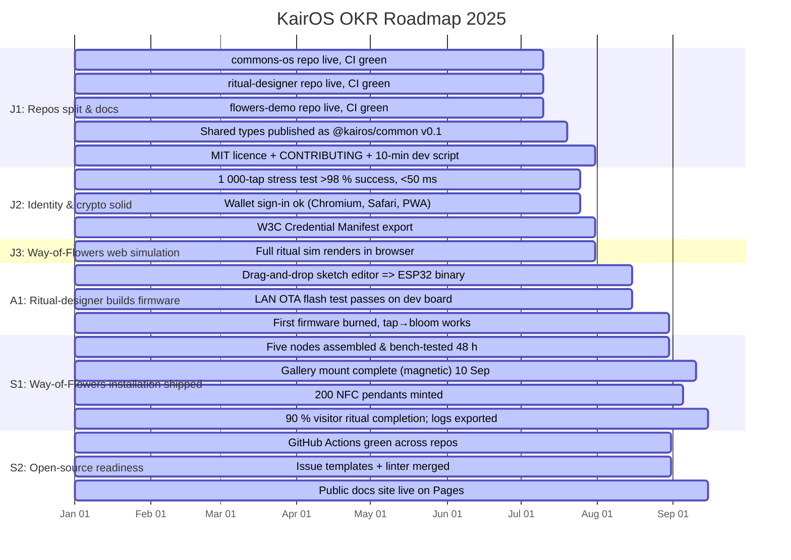

# KairOS OKR Roadmap 2025

**North Star:** Data Commons OS for democratic cryptography and privacy-preserving social computing.

**Horizon:** 2025-09-15

## Roadmap Visualization

## Objectives Overview

| ID | Title | Owner | Due Date | Status |
|----|----|----|----|----|
| J1 | Repos split & docs | Sam | 2025-07-31 | 🟡 In Progress |
| J2 | Identity & crypto solid | Lea | 2025-07-31 | 🟡 In Progress |
| J3 | Way-of-Flowers web simulation | Mei | 2025-07-31 | 🟡 In Progress |
| A1 | Ritual-designer builds firmware | Noor | 2025-08-31 | 🟡 In Progress |
| S1 | Way-of-Flowers installation shipped | Mei | 2025-09-15 | 🟡 In Progress |
| S2 | Open-source readiness | Dan | 2025-09-15 | 🟡 In Progress |

## Key Results

### J1: Repos split & docs

- 🟡 **J1a:** commons-os repo live, CI green *(Due: 2025-07-10)*
- 🟡 **J1b:** ritual-designer repo live, CI green *(Due: 2025-07-10)*
- 🟡 **J1c:** flowers-demo repo live, CI green *(Due: 2025-07-10)*
- 🟡 **J1d:** Shared types published as @kairos/common v0.1 *(Due: 2025-07-20)*
- 🟡 **J1e:** MIT licence + CONTRIBUTING + 10-min dev script *(Due: 2025-07-31)*

### J2: Identity & crypto solid

- 🟡 **J2a:** 1 000-tap stress test >98 % success, <50 ms *(Due: 2025-07-25)*
- 🟡 **J2b:** Wallet sign-in ok (Chromium, Safari, PWA) *(Due: 2025-07-25)*
- 🟡 **J2c:** W3C Credential Manifest export *(Due: 2025-07-31)*

### J3: Way-of-Flowers web simulation

- 🟡 **J3a:** Full ritual sim renders in browser *(Due: 2025-07-31)*

### A1: Ritual-designer builds firmware

- 🟡 **A1a:** Drag-and-drop sketch editor => ESP32 binary *(Due: 2025-08-15)*
- 🟡 **A1b:** LAN OTA flash test passes on dev board *(Due: 2025-08-15)*
- 🟡 **A1c:** First firmware burned, tap→bloom works *(Due: 2025-08-30)*

### S1: Way-of-Flowers installation shipped

- 🟡 **S1a:** Five nodes assembled & bench-tested 48 h *(Due: 2025-08-30)*
- 🟡 **S1b:** Gallery mount complete (magnetic) 10 Sep *(Due: 2025-09-10)*
- 🟡 **S1c:** 200 NFC pendants minted *(Due: 2025-09-05)*
- 🟡 **S1d:** 90 % visitor ritual completion; logs exported *(Due: 2025-09-15)*

### S2: Open-source readiness

- 🟡 **S2a:** GitHub Actions green across repos *(Due: 2025-08-31)*
- 🟡 **S2b:** Issue templates + linter merged *(Due: 2025-08-31)*
- 🟡 **S2c:** Public docs site live on Pages *(Due: 2025-09-15)*

---

*Last updated: 2025-07-03*
*Edit [okrs.yml](./okrs.yml) to update this roadmap*
