# 🎯 KairOS OKR Roadmap 2025

> **North Star**: Build KairOS: democratic cryptography, privacy-preserving social computing, NFC identity.

---

## 🌟 Vision & Mission

KairOS represents a paradigm shift toward **democratic cryptography** and **privacy-preserving social computing**. Our mission is to create a decentralized ecosystem where individuals maintain sovereignty over their digital identity through innovative NFC-based authentication and cryptographic protocols.

### Core Principles
- **🔐 Privacy First**: Zero-knowledge proofs and local-first data storage
- **🌐 Decentralized**: No single point of failure or control
- **🤝 Democratic**: Community-driven governance and open-source development
- **⚡ Accessible**: Simple, intuitive interfaces for complex cryptographic operations

---

## 📅 2025 Roadmap Overview

| Quarter | Focus Area | Key Deliverables | Status |
|---------|------------|------------------|--------|
| **Q1** | Contributor Onboarding & Auth Foundation | Setup docs, NFC auth, wallet integration | 🟡 In Progress |
| **Q2** | Performance & Pipeline Optimisation | Dev experience, testing, mobile UX | 🔵 Planned |
| **Q3** | Modular Repos & Ritual Designer | Repo splitting, ESP32 simulation, firmware | 🔵 Planned |
| **Q4** | Open-Source Polish & Ecosystem | Multi-installation, APIs, documentation | 🔵 Planned |

---

## 🕒 Timeline Overview

```mermaid
timeline
    title KairOS 2025 Timeline
    Q1: Contributor Onboarding & Auth Foundation
        : Q1a Setup docs enable <10-min cont...
        : Q1b NFC auth ≥98 % success across ...
        : Q1c Wallet sign-in works (Chromium...
        : Q1d Final NFC-URL scheme spec + ca...
        : Q1e Profiles stored locally and DI...
    Q2: Performance & Pipeline Optimisation
        : Q2a Cold-start dev server <2 s con...
        : Q2b Error-recovery flows for all c...
        : Q2c Comprehensive test suite >90 %...
        : Q2d Automated production deploy pi...
        : Q2e Mobile UX optimised for iOS & ...
    Q3: Modular Repos & Ritual Designer
        : Q3a kairos-core repo live, CI gree...
        : Q3b ritual-designer repo live, dep...
        : Q3c way-of-flowers repo live, depl...
        : Q3d Shared types package @kairos/c...
        : Q3e 10-min dev script + MIT licenc...
        : Q3f Web simulation of full Way-of-...
        : Q3g Simulation preview embedded in...
        : Q3h Sketch editor compiles ESP32 b...
        : Q3i LAN OTA flash succeeds on dev ...
        : Q3j Way-of-Flowers firmware flashe...
        : Q3k Five simulated nodes run ritua...
    Q4: Open-Source Polish & Ecosystem
        : Q4a Multi-installation dashboard (...
        : Q4b Developer API + SDK for third-...
        : Q4c Docs site with step-by-step tu...
        : Q4d Contribution guidelines + revi...
        : Q4e Performance monitoring dashboa...
```

#### 🗂️ Timeline Legend

| ID | Full Task Name | Due Date |
|----|----------------|----------|
| Q1a | Setup docs enable <10-min contributor onboarding | 2025-01-15 |
| Q1b | NFC auth ≥98 % success across devices (1 000-tap test) | 2025-02-28 |
| Q1c | Wallet sign-in works (Chromium / Safari / PWA) | 2025-02-28 |
| Q1d | Final NFC-URL scheme spec + card-writer CLI 100 % accurate | 2025-02-15 |
| Q1e | Profiles stored locally and DID-synced cross-device | 2025-03-15 |
| Q2a | Cold-start dev server <2 s consistently | 2025-04-15 |
| Q2b | Error-recovery flows for all critical journeys | 2025-05-15 |
| Q2c | Comprehensive test suite >90 % coverage | 2025-06-15 |
| Q2d | Automated production deploy pipeline (CI → Vercel) | 2025-06-30 |
| Q2e | Mobile UX optimised for iOS & Android (<2 s FCP) | 2025-06-30 |
| Q3a | kairos-core repo live, CI green, deployed at core.kairos.app | 2025-07-10 |
| Q3b | ritual-designer repo live, deployed at designer.kairos.app | 2025-07-10 |
| Q3c | way-of-flowers repo live, deployed at flowers.kairos.app | 2025-07-10 |
| Q3d | Shared types package @kairos/common v0.1 published | 2025-07-20 |
| Q3e | 10-min dev script + MIT licence + CONTRIBUTING in each repo | 2025-07-31 |
| Q3f | Web simulation of full Way-of-Flowers ritual | 2025-07-25 |
| Q3g | Simulation preview embedded in Ritual Designer | 2025-07-31 |
| Q3h | Sketch editor compiles ESP32 binary (drag-and-drop) | 2025-08-08 |
| Q3i | LAN OTA flash succeeds on dev board | 2025-08-15 |
| Q3j | Way-of-Flowers firmware flashed; tap → bloom works | 2025-08-30 |
| Q3k | Five simulated nodes run ritual 48 h without error | 2025-09-10 |
| Q4a | Multi-installation dashboard (manage >1 ritual) | 2025-11-30 |
| Q4b | Developer API + SDK for third-party integrations | 2025-12-15 |
| Q4c | Docs site with step-by-step tutorials live | 2025-11-15 |
| Q4d | Contribution guidelines + review process published | 2025-10-31 |
| Q4e | Performance monitoring dashboard (Core Web Vitals) | 2025-12-31 |

## 🎯 Quarterly Objectives

### Q1 2025: Contributor Onboarding & Auth Foundation
**Owner**: Brad | **End Date**: March 31, 2025

**Objective**: Establish a solid foundation for contributor onboarding and authentication systems to enable rapid project growth and reliable user experiences.

#### Key Results
- **Q1a**: Setup docs enable <10-min contributor onboarding *(Due: Jan 15)*
- **Q1b**: NFC auth ≥98% success across devices (1,000-tap test) *(Due: Feb 28)*
- **Q1c**: Wallet sign-in works (Chromium / Safari / PWA) *(Due: Feb 28)*
- **Q1d**: Final NFC-URL scheme spec + card-writer CLI 100% accurate *(Due: Feb 15)*
- **Q1e**: Profiles stored locally and DID-synced cross-device *(Due: Mar 15)*

#### Success Metrics
- [ ] New contributors can set up dev environment in under 10 minutes
- [ ] NFC authentication success rate exceeds 98% across test devices
- [ ] Wallet integration works seamlessly across major browsers
- [ ] NFC-URL scheme specification is complete and validated
- [ ] User profiles sync reliably across multiple devices

---

### Q2 2025: Performance & Pipeline Optimisation
**Owner**: Brad | **End Date**: June 30, 2025

**Objective**: Optimize development experience and production performance to support rapid iteration and excellent user experience across all platforms.

#### Key Results
- **Q2a**: Cold-start dev server <2s consistently *(Due: Apr 15)*
- **Q2b**: Error-recovery flows for all critical journeys *(Due: May 15)*
- **Q2c**: Comprehensive test suite >90% coverage *(Due: Jun 15)*
- **Q2d**: Automated production deploy pipeline (CI → Vercel) *(Due: Jun 30)*
- **Q2e**: Mobile UX optimised for iOS & Android (<2s FCP) *(Due: Jun 30)*

#### Success Metrics
- [ ] Development server starts consistently under 2 seconds
- [ ] All critical user journeys have robust error recovery
- [ ] Test coverage exceeds 90% with comprehensive integration tests
- [ ] Production deployments are fully automated and reliable
- [ ] Mobile First Contentful Paint under 2 seconds on average devices

---

### Q3 2025: Modular Repos & Ritual Designer
**Owner**: Brad | **End Date**: September 30, 2025

**Objective**: Split the monolithic repository into focused modules and create a visual ritual designer with ESP32 simulation capabilities.

#### Repository Modularization
- **Q3a**: kairos-core repo live, CI green, deployed at core.kairos.app *(Due: Jul 10)*
- **Q3b**: ritual-designer repo live, deployed at designer.kairos.app *(Due: Jul 10)*
- **Q3c**: way-of-flowers repo live, deployed at flowers.kairos.app *(Due: Jul 10)*
- **Q3d**: Shared types package @kairos/common v0.1 published *(Due: Jul 20)*
- **Q3e**: 10-min dev script + MIT licence + CONTRIBUTING in each repo *(Due: Jul 31)*

#### Simulation & Designer
- **Q3f**: Web simulation of full Way-of-Flowers ritual *(Due: Jul 25)*
- **Q3g**: Simulation preview embedded in Ritual Designer *(Due: Jul 31)*
- **Q3h**: Sketch editor compiles ESP32 binary (drag-and-drop) *(Due: Aug 8)*
- **Q3i**: LAN OTA flash succeeds on dev board *(Due: Aug 15)*
- **Q3j**: Way-of-Flowers firmware flashed; tap → bloom works *(Due: Aug 30)*
- **Q3k**: Five simulated nodes run ritual 48h without error *(Due: Sep 10)*

#### Success Metrics
- [ ] All repositories have independent CI/CD pipelines
- [ ] Shared types package enables consistent APIs across repos
- [ ] Visual ritual designer allows drag-and-drop ritual creation
- [ ] ESP32 firmware can be compiled and flashed from web interface
- [ ] Simulation environment runs extended stress tests successfully

---

### Q4 2025: Open-Source Polish & Ecosystem
**Owner**: Brad | **End Date**: December 31, 2025

**Objective**: Polish the open-source ecosystem with comprehensive documentation, APIs, and multi-installation support for broader adoption.

#### Key Results
- **Q4a**: Multi-installation dashboard (manage >1 ritual) *(Due: Nov 30)*
- **Q4b**: Developer API + SDK for third-party integrations *(Due: Dec 15)*
- **Q4c**: Docs site with step-by-step tutorials live *(Due: Nov 15)*
- **Q4d**: Contribution guidelines + review process published *(Due: Oct 31)*
- **Q4e**: Performance monitoring dashboard (Core Web Vitals) *(Due: Dec 31)*

#### Success Metrics
- [ ] Users can manage multiple ritual installations from single dashboard
- [ ] Third-party developers can integrate using comprehensive SDK
- [ ] Documentation site provides clear tutorials for all use cases
- [ ] Contribution process is well-documented and consistently followed
- [ ] Performance monitoring provides actionable insights

---

## 📊 Gantt Chart Overview

#### ��️ Gantt Chart Legend

| ID | Full Task Name | Due Date |
|----|----------------|----------|
| Q1a | Setup docs enable <10-min contributor onboarding | 2025-01-15 |
| Q1b | NFC auth ≥98 % success across devices (1 000-tap test) | 2025-02-28 |
| Q1c | Wallet sign-in works (Chromium / Safari / PWA) | 2025-02-28 |
| Q1d | Final NFC-URL scheme spec + card-writer CLI 100 % accurate | 2025-02-15 |
| Q1e | Profiles stored locally and DID-synced cross-device | 2025-03-15 |
| Q2a | Cold-start dev server <2 s consistently | 2025-04-15 |
| Q2b | Error-recovery flows for all critical journeys | 2025-05-15 |
| Q2c | Comprehensive test suite >90 % coverage | 2025-06-15 |
| Q2d | Automated production deploy pipeline (CI → Vercel) | 2025-06-30 |
| Q2e | Mobile UX optimised for iOS & Android (<2 s FCP) | 2025-06-30 |
| Q3a | kairos-core repo live, CI green, deployed at core.kairos.app | 2025-07-10 |
| Q3b | ritual-designer repo live, deployed at designer.kairos.app | 2025-07-10 |
| Q3c | way-of-flowers repo live, deployed at flowers.kairos.app | 2025-07-10 |
| Q3d | Shared types package @kairos/common v0.1 published | 2025-07-20 |
| Q3e | 10-min dev script + MIT licence + CONTRIBUTING in each repo | 2025-07-31 |
| Q3f | Web simulation of full Way-of-Flowers ritual | 2025-07-25 |
| Q3g | Simulation preview embedded in Ritual Designer | 2025-07-31 |
| Q3h | Sketch editor compiles ESP32 binary (drag-and-drop) | 2025-08-08 |
| Q3i | LAN OTA flash succeeds on dev board | 2025-08-15 |
| Q3j | Way-of-Flowers firmware flashed; tap → bloom works | 2025-08-30 |
| Q3k | Five simulated nodes run ritual 48 h without error | 2025-09-10 |
| Q4a | Multi-installation dashboard (manage >1 ritual) | 2025-11-30 |
| Q4b | Developer API + SDK for third-party integrations | 2025-12-15 |
| Q4c | Docs site with step-by-step tutorials live | 2025-11-15 |
| Q4d | Contribution guidelines + review process published | 2025-10-31 |
| Q4e | Performance monitoring dashboard (Core Web Vitals) | 2025-12-31 |
mermaid

| ID | Full Task Name | Due Date |
|----|----------------|----------|
| Q1a | Setup docs enable <10-min contributor onboarding | 2025-01-15 |
| Q1b | NFC auth ≥98 % success across devices (1 000-tap test) | 2025-02-28 |
| Q1c | Wallet sign-in works (Chromium / Safari / PWA) | 2025-02-28 |
| Q1d | Final NFC-URL scheme spec + card-writer CLI 100 % accurate | 2025-02-15 |
| Q1e | Profiles stored locally and DID-synced cross-device | 2025-03-15 |
| Q2a | Cold-start dev server <2 s consistently | 2025-04-15 |
| Q2b | Error-recovery flows for all critical journeys | 2025-05-15 |
| Q2c | Comprehensive test suite >90 % coverage | 2025-06-15 |
| Q2d | Automated production deploy pipeline (CI → Vercel) | 2025-06-30 |
| Q2e | Mobile UX optimised for iOS & Android (<2 s FCP) | 2025-06-30 |
| Q3a | kairos-core repo live, CI green, deployed at core.kairos.app | 2025-07-10 |
| Q3b | ritual-designer repo live, deployed at designer.kairos.app | 2025-07-10 |
| Q3c | way-of-flowers repo live, deployed at flowers.kairos.app | 2025-07-10 |
| Q3d | Shared types package @kairos/common v0.1 published | 2025-07-20 |
| Q3e | 10-min dev script + MIT licence + CONTRIBUTING in each repo | 2025-07-31 |
| Q3f | Web simulation of full Way-of-Flowers ritual | 2025-07-25 |
| Q3g | Simulation preview embedded in Ritual Designer | 2025-07-31 |
| Q3h | Sketch editor compiles ESP32 binary (drag-and-drop) | 2025-08-08 |
| Q3i | LAN OTA flash succeeds on dev board | 2025-08-15 |
| Q3j | Way-of-Flowers firmware flashed; tap → bloom works | 2025-08-30 |
| Q3k | Five simulated nodes run ritual 48 h without error | 2025-09-10 |
| Q4a | Multi-installation dashboard (manage >1 ritual) | 2025-11-30 |
| Q4b | Developer API + SDK for third-party integrations | 2025-12-15 |
| Q4c | Docs site with step-by-step tutorials live | 2025-11-15 |
| Q4d | Contribution guidelines + review process published | 2025-10-31 |
| Q4e | Performance monitoring dashboard (Core Web Vitals) | 2025-12-31 |

---

## 🎯 Key Milestones

### 🚀 Major Releases

| Milestone | Date | Description |
|-----------|------|-------------|
| **Alpha Release** | Q1 2025 | Core authentication and NFC functionality |
| **Beta Release** | Q2 2025 | Performance-optimized with comprehensive testing |
| **Modular Release** | Q3 2025 | Separate repositories with ritual designer |
| **Ecosystem Release** | Q4 2025 | Full API, documentation, and multi-installation support |

### 🔄 Continuous Deliverables

- **Weekly**: Development progress updates
- **Monthly**: Community demos and feedback sessions
- **Quarterly**: Major feature releases and roadmap reviews

---

## 🛠️ Technical Architecture

### Core Components
- **🔐 Cryptographic Core**: Zero-knowledge proofs, DID management
- **📱 NFC Interface**: Hardware abstraction layer for NFC operations
- **🌐 Web Platform**: Progressive web app with offline capabilities
- **⚡ ESP32 Firmware**: Embedded systems for physical installations
- **🎨 Ritual Designer**: Visual interface for creating cryptographic rituals

### Technology Stack
- **Frontend**: Next.js, React, TypeScript
- **Backend**: Node.js, Vercel Functions
- **Cryptography**: WebCrypto API, custom ZK implementations
- **Hardware**: ESP32, NFC readers, custom PCBs
- **Infrastructure**: Vercel, GitHub Actions, IPFS

---

## 🤝 Community & Collaboration

### Contribution Areas
- **🔧 Core Development**: Cryptographic protocols, NFC integration
- **🎨 Design**: UI/UX, ritual designer, documentation
- **📚 Documentation**: Tutorials, API docs, community guides
- **🧪 Testing**: Device testing, security audits, performance testing
- **🌐 Community**: Outreach, education, governance

### Getting Started
1. **Read the Setup Docs** (Q1a deliverable)
2. **Join Community Discussions** on GitHub
3. **Pick a First Issue** from the contributor board
4. **Follow Contribution Guidelines** (Q4d deliverable)

---

## 📈 Success Metrics

### Technical Metrics
- **Performance**: <2s load times, >98% uptime
- **Security**: Zero critical vulnerabilities, regular audits
- **Compatibility**: Support for all major browsers and devices
- **Test Coverage**: >90% code coverage with integration tests

### Community Metrics
- **Contributors**: Growing number of active contributors
- **Deployments**: Multiple installations across different contexts
- **Documentation**: Comprehensive guides and tutorials
- **Feedback**: Regular community input and iteration

---

## 🔮 Future Vision (2026+)

### Long-term Goals
- **🌍 Global Adoption**: Installations across educational institutions and communities
- **🔬 Research Integration**: Academic partnerships and publications
- **🏛️ Governance Evolution**: Decentralized governance protocols
- **🚀 Platform Expansion**: Support for additional hardware and use cases

### Emerging Opportunities
- **🎓 Educational Partnerships**: Integration with computer science curricula
- **🏢 Enterprise Applications**: Privacy-preserving authentication for organizations
- **🌐 Interoperability**: Standards development for decentralized identity
- **🔬 Research Collaboration**: Academic research on cryptographic social computing

---

## 📞 Contact & Resources

- **📧 Email**: [Contact Information]
- **💬 Discord**: [Community Server]
- **🐙 GitHub**: [Repository Links]
- **📖 Documentation**: [Docs Site]
- **🎥 Demos**: [Video Tutorials]

---

*Last Updated: December 2024 | Next Review: Q1 2025*
