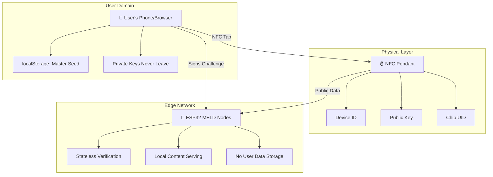
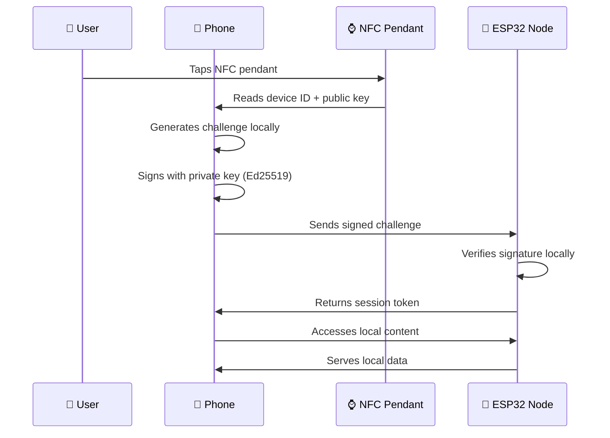

# 🏗️ KairOS Architecture Guide

> **Professional-grade decentralized authentication system architecture**  
> Zero-database • Real cryptography • Enterprise scalability

---

## 🎯 **System Overview**

KairOS implements a **truly decentralized authentication architecture** where users maintain complete control over their cryptographic identity while seamlessly accessing edge computing devices through beautiful NFC pendants.

### **Core Principles**
- 🔒 **Privacy First**: Private keys never leave user's device
- 🌐 **Decentralized**: No central servers or databases
- ⚡ **Edge Computing**: Local verification and content serving
- 🎨 **Beautiful UX**: Professional-grade user experience

---

## 🏛️ **Decentralized Architecture**

### **Three-Tier Architecture**


### **Data Flow Architecture**


---

## 💾 **Data Storage Strategy**

### **User's Phone (localStorage)**
```typescript
interface LocalIdentity {
  masterSeed: string              // 32-byte master seed (NEVER leaves device)
  userId: string                  // User's chosen identifier
  devices: {
    [deviceId: string]: {
      deviceId: string            // Unique device identifier
      deviceName: string          // Human-readable name
      publicKey: string           // Ed25519 public key (32 bytes)
      privateKey: string          // Ed25519 private key (32 bytes) - LOCAL ONLY
      chipUID: string             // NFC chip unique identifier
      createdAt: number           // Registration timestamp
    }
  }
}
```

### **NFC Pendant (Public Data Only)**
```
┌─ NFC Memory Layout ────────────────────────┐
│                                            │
│  Device ID: "pendant-1704067200000"        │
│  Public Key: "a1b2c3d4e5f6..." (32 bytes) │
│  Chip UID: "04:AB:CD:EF:12:34:56"         │
│  Auth URL: "https://app.com/nfc?d=..."    │
│                                            │
│  🚫 NO PRIVATE KEYS STORED                │
│                                            │
└────────────────────────────────────────────┘
```

### **ESP32 MELD Nodes (Stateless)**
```
┌─ ESP32 Node Configuration ─────────────────┐
│                                            │
│  IP Address: 192.168.1.XXX                │
│  Web Server: Port 8080                    │
│  Local Content: Audio files, documents    │
│  Verification: Ed25519 signature only     │
│                                            │
│  🚫 NO PRIVATE KEYS                       │
│  🚫 NO USER DATA                          │
│  🚫 NO PERSISTENT SESSIONS                │
│                                            │
└────────────────────────────────────────────┘
```

---

## 🔐 **Cryptographic Architecture**

### **Ed25519 Implementation Stack**
```
┌─ Cryptographic Stack ──────────────────────┐
│                                            │
│  Frontend: @noble/ed25519 v2.2.3          │
│  Backend:  @noble/ed25519 v2.2.3          │
│  Hardware: libsodium (C++) / ed25519-donna│
│                                            │
│  Key Size: 32 bytes (256 bits)            │
│  Signature: 64 bytes (512 bits)           │
│  Security: ~128-bit quantum resistance    │
│                                            │
└────────────────────────────────────────────┘
```

### **Key Derivation Strategy**
```typescript
// Master seed (stored in phone localStorage only)
const masterSeed = generateSecureRandom(32)

// Device-specific key derivation
const devicePrivateKey = deriveKey(masterSeed, deviceId, "device-auth")
const devicePublicKey = getPublicKey(devicePrivateKey)

// Challenge-response authentication
const challenge = `KairOS-Local-${deviceId}-${timestamp}`
const signature = await sign(challenge, devicePrivateKey)
const verified = await verify(signature, challenge, devicePublicKey)
```

### **DID:Key Standards Compliance**
```typescript
// Standards-compliant DID generation
const didKey = `did:key:z${base58btc.encode(multicodec.encode(publicKey))}`

// Example: did:key:z6MkhaXgBZDvotDkL5257faiztiGiC2QtKLGpbnnEGta2doK
```

---

## 🌐 **Network Architecture**

### **Local Network Topology**
```
📱 User's Phone (192.168.1.50)
├── 🤖 Audio Transcriber (192.168.1.100:8080)
├── 🤖 File Server (192.168.1.101:3000)
├── 🤖 AI Inference (192.168.1.102:8080)
└── 🤖 MELD Node N (192.168.1.XXX:8080)
```

### **Authentication Protocol**
```http
POST http://192.168.1.100:8080/auth
Content-Type: application/json

{
  "deviceId": "pendant-1704067200000",
  "challenge": "KairOS-Local-pendant-1704067200000-1704067200000",
  "signature": "a1b2c3d4e5f6...",
  "publicKey": "def456..."
}

Response:
{
  "verified": true,
  "sessionToken": "local_session_1704067200000",
  "contentEndpoint": "http://192.168.1.100:8080/content"
}
```

---

## 🏗️ **Frontend Architecture**

### **Component Architecture**
```
app/nfc/
├── page.tsx                    # Main entry point
├── components/                 # UI Components
│   ├── NFCStatusDisplay.tsx   # Beautiful status visualization
│   ├── NFCProgressIndicator.tsx# Progress tracking
│   ├── NFCDebugPanel.tsx      # Developer tools
│   ├── NFCWelcomeScreen.tsx   # Welcome interface
│   └── NFCAuthFlow.tsx        # Main authentication flow
├── hooks/                      # Business Logic Hooks
│   ├── useNFCAuthentication.ts# Authentication management
│   ├── useDeviceDetection.ts  # Device capability detection
│   └── useNFCParameterParser.ts# URL parameter parsing
├── utils/                      # Core Utilities
│   ├── nfc-authentication.ts  # Authentication engine
│   ├── device-detection.ts    # Device detection
│   └── nfc-parameter-parser.ts# Parameter parsing
└── types/                      # TypeScript Definitions
    └── nfc.types.ts           # Core type definitions
```

### **State Management Pattern**
```typescript
// Clean hook-based state management
const { verificationState, executeAuthentication } = useNFCAuthentication()
const { parsedParams, format } = useNFCParameterParser()
const { capabilities, isOptimalEnvironment } = useDeviceDetection()
```

---

## 🔧 **Hardware Architecture**

### **ESP32 MELD Node Firmware**
```c
// ESP32 Authentication Server
#include <WiFi.h>
#include <WebServer.h>
#include <sodium.h>

WebServer server(8080);

void handleAuth() {
  // Parse authentication request
  String deviceId = server.arg("deviceId");
  String challenge = server.arg("challenge");
  String signature = server.arg("signature");
  String publicKey = server.arg("publicKey");
  
  // Verify Ed25519 signature
  if (crypto_sign_verify_detached(
    signature.c_str(), 
    challenge.c_str(), 
    challenge.length(), 
    publicKey.c_str()
  ) == 0) {
    // Authentication successful
    server.send(200, "application/json", 
      "{\"verified\": true, \"sessionToken\": \"" + generateSession() + "\"}");
  } else {
    server.send(401, "application/json", "{\"verified\": false}");
  }
}
```

### **NFC Chip Programming**
```
NTAG213/215/216 Memory Layout:
┌─ Block 0-3: Chip UID (Read-Only) ────────┐
├─ Block 4-7: Device Configuration ────────┤
│  └─ Device ID (16 bytes)                 │
├─ Block 8-15: Public Key ─────────────────┤
│  └─ Ed25519 Public Key (32 bytes)       │
├─ Block 16-19: Authentication URL ────────┤
│  └─ https://app.com/nfc?d=...&c=...     │
└─ Block 20+: Reserved ────────────────────┘
```

---

## 📊 **Performance Architecture**

### **Scalability Metrics**
- **Concurrent Users**: Limited only by ESP32 CPU (typically 50-100)
- **Authentication Latency**: <100ms (local network)
- **Key Operations**: <10ms per crypto operation
- **Memory Usage**: <1MB per ESP32 node

### **Performance Optimizations**
```typescript
// Client-side optimizations
const auth = useMemo(() => new NFCAuthenticationEngine(), [])
const verification = useCallback(async (params) => {
  return auth.authenticate(params)
}, [auth])

// Hardware optimizations
#define CRYPTO_PRECOMPUTE_KEYS 1
#define ENABLE_HARDWARE_CRYPTO 1
```

---

## 🔮 **Future Architecture**

### **Quantum-Resistant Roadmap**
- **Phase 1**: Ed25519 (current) - ~128-bit quantum resistance
- **Phase 2**: Dilithium post-quantum signatures (when standardized)
- **Phase 3**: Hybrid classical + post-quantum schemes

### **Scalability Evolution**
- **Local Network**: Current implementation (1-100 devices)
- **Mesh Network**: P2P device discovery and authentication
- **Inter-Network**: Secure cross-network authentication

### **Hardware Evolution**
- **Current**: ESP32, Raspberry Pi
- **Next**: RISC-V, dedicated crypto chips
- **Future**: Quantum-resistant hardware modules

---

This architecture provides the foundation for a truly decentralized, private, and scalable authentication system that grows with users' needs while maintaining the highest security standards. 