# 🔐 KairOS Current Implementation

> **What's actually working in production right now**  
> Deterministic key derivation • PIN-based security • Vercel KV + localStorage architecture

---

## 🎯 **TL;DR - What You're Using**

KairOS implements **deterministic NFC authentication** where your private keys are computed on-demand from your PIN + chipUID combination. Think of it like a password manager that generates the same password every time from your master password + website name. **No private keys are ever stored anywhere - they're computed fresh each time.**

---

## 🔐 **Authentication Flow (Currently Working)**

### **Step-by-Step Process**

```mermaid
sequenceDiagram
    participant User as 👤 User
    participant NFC as 📱 NFC Card
    participant App as 🖥️ Browser App
    participant KV as 🗃️ Vercel KV
    participant LS as 🏠 localStorage
    
    User->>NFC: Taps NFC card
    NFC->>App: Returns chipUID (e.g., "04:38:02:E3:B4:9C:74")
    App->>KV: Check if chipUID has account
    KV->>App: Return account status
    App->>User: Prompt for PIN entry
    User->>App: Enters PIN (e.g., "1234")
    App->>App: privateKey = HKDF(chipUID + PIN)
    App->>App: publicKey = ed25519.getPublicKey(privateKey)
    App->>KV: Store/update account {chipUID, accountId, publicKey}
    App->>LS: Store rich profile data locally
    App->>User: ✅ Authentication successful → Profile access
```


### **What's On The NFC Card**
```
ONLY THIS:
https://kair-os.vercel.app/nfc?chipUID=04%3A38%3A02%3AE3%3AB4%3A9C%3A74

That's it! No private keys, no signatures, no secrets.
Just a public chipUID that identifies the card.
```

### **What Happens During Authentication**
1. **Account Recognition** (Database lookup):
   ```javascript
   // Check if we've seen this chipUID before
   const account = await kv.get(`account:${chipUID}`)
   ```

2. **Key Derivation** (Client-side, never stored):
   ```javascript
   // Same PIN + chipUID = same private key every time
   const seedMaterial = `KairOS-Secure-v2:${chipUID}:pin:${pin}`
   const privateKey = HKDF(sha512, seedMaterial, salt, info, 32)
   ```

3. **Public Key Generation** (Client-side):
   ```javascript
   const publicKey = await ed25519.getPublicKey(privateKey)
   const accountId = sha256(chipUID).slice(0, 16)
   ```

4. **Data Storage** (Hybrid approach):
   ```javascript
   // Minimal data in database for cross-device recognition
   await kv.set(`account:${accountId}`, { chipUID, publicKey, did })
   
   // Rich profile data stays local
   localStorage.setItem(`profile:${chipUID}`, encryptedProfile)
   ```

---

## 🔒 **Security Features (Production Ready)**

### **Deterministic Key Generation**
- **Reproducible**: Same PIN + chipUID = identical private key every time
- **No storage**: Private keys computed on-demand, immediately discarded
- **Cross-device**: Same PIN works on any device for the same chipUID
- **HKDF**: RFC 5869 compliant key derivation function

### **Key Security**
- **PIN-based**: Keys derived from `HKDF(chipUID + PIN)` combination
- **Ed25519**: Quantum-resistant elliptic curve cryptography
- **256-bit security**: Industry-standard key length
- **Key clamping**: Proper Ed25519 key formatting

### **Data Privacy**
- **Minimal database**: Only chipUID → accountId mapping in Vercel KV
- **Local profiles**: Rich personal data stays in browser localStorage
- **Encrypted PINs**: Cross-device PIN storage for account recognition
- **No tracking**: System can't correlate activities across devices

---

## 📱 **What's Stored Where**

### **NFC Card** (Public data only)
```json
{
  "url": "https://kair-os.vercel.app/nfc?chipUID=04%3A38%3A02%3AE3%3AB4%3A9C%3A74",
  "chipUID": "04:38:02:E3:B4:9C:74"
}
```
🔓 **No secrets, no private keys, no sensitive data**

### **Vercel KV Database** (Minimal recognition data)
```json
{
  "account:abc123": {
    "chipUID": "04:38:02:E3:B4:9C:74",
    "accountId": "abc123",
    "publicKey": "ed25519_public_key_hex",
    "did": "did:key:z...",
    "encryptedPIN": "encrypted_for_cross_device_access",
    "createdAt": "2025-01-...",
    "lastSeen": "2025-01-..."
  }
}
```
🔒 **Only what's needed for cross-device recognition**

### **User's Browser localStorage** (Rich local data)
```json
{
  "profile:04:38:02:E3:B4:9C:74": {
    "displayName": "Alice",
    "bio": "Web3 enthusiast",
    "preferences": { "theme": "dark" },
    "moments": [...],
    "stats": { "totalSessions": 42 }
  }
}
```
🏠 **Rich personal data stays on your device**

### **Computed On-Demand** (Never stored)
```javascript
// Private keys are computed fresh each time
const privateKey = derivePrivateKeyFromChipAndPIN(chipUID, pin)
// ❌ NEVER saved to disk, database, or localStorage
// ✅ Computed when needed, discarded immediately
```

---

## 🧪 **Testing the Current Implementation**

### **Live Production Test**
Visit: **https://kair-os.vercel.app/nfc?chipUID=04:38:02:E3:B4:9C:74**

1. Click the URL above
2. Enter PIN: `1234` (or any PIN you choose)
3. Watch deterministic identity generation
4. See how the same PIN gives you the same identity
5. Try different PINs to see different identities

### **Development Testing**
```bash
git clone https://github.com/BradleyRoyes/KairOS.git
cd KairOS
pnpm install
pnpm dev
```

Visit these test pages:
- `/chip-config` - Generate your own NFC URLs
- `/nfc-test` - Validate key derivation works correctly
- `/nfc` - Main authentication interface

---

## 🔧 **Code Implementation Details**

### **Core Key Derivation** (`lib/crypto/optimalDecentralizedAuth.ts`)
```typescript
export function derivePrivateKeyFromChipAndPIN(chipUID: string, pin: string): Uint8Array {
  // Create deterministic but secure private key
  const seedMaterial = `KairOS-Secure-v2:${chipUID}:pin:${pin}`;
  const salt = new TextEncoder().encode('KairOS-Auth-Salt-2025');
  const info = new TextEncoder().encode(`device:${chipUID}`);
  
  // Use HKDF for proper key derivation (RFC 5869)
  const seedBytes = new TextEncoder().encode(seedMaterial);
  const derivedKey = hkdf(sha512, seedBytes, salt, info, 32);
  
  // Ensure valid Ed25519 private key with proper clamping
  const privateKey = new Uint8Array(32);
  privateKey.set(derivedKey);
  
  // Ed25519 key clamping
  privateKey[0] &= 248;
  privateKey[31] &= 127;
  privateKey[31] |= 64;
  
  return privateKey;
}
```

### **Account Manager** (`lib/nfc/accountManager.ts`)
```typescript
class NFCAccountManager {
  static async authenticateOrCreateAccount(chipUID: string): Promise<{
    account: LocalAccountProfile
    isNewAccount: boolean
    isNewDevice: boolean
  }> {
    // Generate deterministic account data
    const deterministicData = await this.generateDeterministicAccountData(chipUID)
    
    // Check database for existing account
    const existingAccount = await this.checkAccountInDatabase(chipUID)
    
    // Check local profile
    const localProfile = this.getLocalProfile(chipUID)
    
    // Handle different scenarios:
    // 1. Local profile exists = returning user on same device
    // 2. Database account exists = returning user on new device  
    // 3. Neither exists = completely new user
    
    return this.handleAuthenticationScenario(
      localProfile, 
      existingAccount, 
      deterministicData
    )
  }
}
```

### **PIN Gate System** (`lib/nfc/accountManager.ts`)
```typescript
static async authenticateWithPINGate(chipUID: string): Promise<{
  requiresPIN: boolean
  isNewAccount: boolean
  isNewDevice: boolean
  hasPIN: boolean
  reason?: string
  account?: any
}> {
  // Check device session (browser fingerprinting)
  const deviceSession = this.getDeviceSession(chipUID)
  
  if (deviceSession?.pinEntered && !this.sessionExpired(deviceSession)) {
    // User recently entered PIN on this device - grant access
    return { requiresPIN: false, ... }
  } else {
    // Require PIN for new sessions
    return { requiresPIN: true, reason: 'PIN required for authentication' }
  }
}
```

### **Cross-Device Recognition** 
```typescript
// When user enters PIN on new device, we encrypt and store it
static async setupPIN(chipUID: string, pin: string): Promise<boolean> {
  const { encryptedPIN, salt } = await this.encryptPIN(pin)
  
  // Store in database for cross-device recognition
  await fetch('/api/nfc/accounts', {
    method: 'POST',
    body: JSON.stringify({
      chipUID,
      encryptedPIN,
      pinSalt: salt,
      hasPIN: true
    })
  })
}
```

---

## 🌟 **Key Benefits of This Architecture**

1. **🔐 True Security**: Private keys never stored anywhere
2. **🌐 Cross-Device**: Same PIN works on any device
3. **🏠 Privacy**: Rich profiles stay local to your browser
4. **⚡ Speed**: No network calls for key generation
5. **📱 Simple**: Just chipUID on NFC card, everything else computed
6. **🔄 Deterministic**: Same input = same output, always
7. **🛡️ Quantum-Resistant**: Ed25519 cryptography
8. **📊 Minimal Data**: Database only stores what's needed for recognition

This is the **actual production system** running at kair-os.vercel.app! 